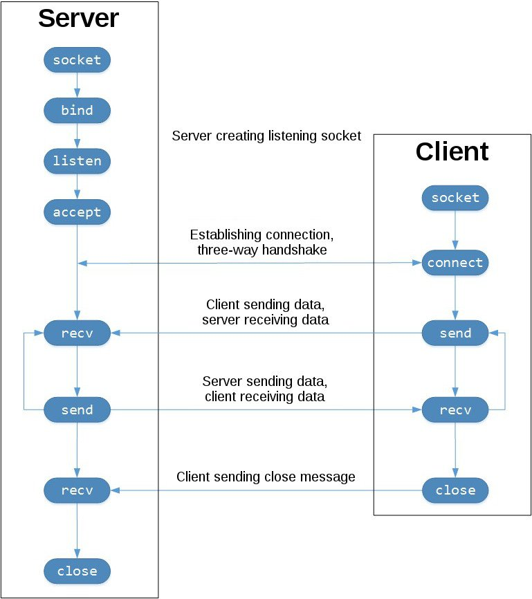

# Sockets
- already from 1971 (APRPANET) and later in BSD (1983)[<sup>1</sup>][socket-background]

## Server vs Client



## Theory
### IPC
- Inter-process communication (IPC)
- Also called Unix Domain Socket[<sup>1</sup>][socket-background]

### Socket types
- TCP
`socket.SOCK_STREAM`
- UDP
`socket.SOCK_DGRAM`

## Code
### API
```py
socket()
.bind()
.listen()
.accept()
.connect()
.connect_ex()
.send()
.recv()
.close()
```


[socket-background]: https://realpython.com/python-sockets/#background